# 📊 Awesome Data Pipeline Observability 🚀

  
  
  
  
  
  
  

## 📌 Top Data Pipeline Observability Platforms Ecosystem

> **Curated List of Enterprise SaaS Products & Open-Source GitHub Projects**  
> *Focused on Data Reliability, Anomaly Detection, Data Freshness & Volume Monitoring, Pipeline Health, Schema Drift Tracking, and Data Downtime Prevention.*

---

## 💡 Overview

This repository tracks top-tier **SaaS platforms** and **open-source frameworks** for **Data Pipeline Observability**. Data observability platforms empower analytics engineers, data engineers, and data platform leaders to detect, triage, and prevent data downtime before broken pipelines impact downstream BI dashboards, ML models, and business operations.

Key monitoring vectors include:
- 🕒 **Freshness Monitoring**: Detecting delayed or missing ETL/ELT pipeline runs.
- 📦 **Volume & Row Count Anomaly Detection**: Identifying abnormal data ingestion spikes or drops.
- 🧬 **Schema Drift Detection**: Catching breaking column additions, removals, or type changes.
- 🕸️ **Data Lineage Tracking**: Visualizing end-to-end data flow from source databases to dashboards.
- 🎯 **Data Quality Testing**: Asserting business rules and statistical data distribution parameters.

---

## 📑 Table of Contents

- [☁️ SaaS / Hosted Platforms](#-saas--hosted-platforms)
- [🔓 Open-Source GitHub Projects](#-open-source-github-projects)
- [⚙️ Open-Source Implementation Playbook](#%EF%B8%8F-open-source-implementation-playbook)
- [🤝 How to Contribute](#-how-to-contribute)
- [💖 Support & Community](#-support--community)
- [📈 Star History](#-star-history)
- [⚖️ Disclaimer](#%EF%B8%8F-disclaimer)

---

## ☁️ SaaS / Hosted Platforms

> 📊 **Estimated Market Size & Sector Dynamics**: The global Data Observability market was valued at **~$450 Million in 2023** and is projected to reach **$3.5+ Billion by 2030** (growing at a CAGR of ~31.2%). The market sector is **moderately fragmented**, actively consolidating as enterprise cloud leaders acquire point observability tools to offer unified data reliability platforms.

*Table sorted by company size and market valuation (descending):*

| Product | Description | Company Size / Valuation | Specific Starting Pricing | Free Tier & Free Trial Limits |
| :--- | :--- | :--- | :--- | :--- |
| 🌐 **[Databand (IBM)](https://www.ibm.com/products/databand)** | IBM's enterprise data pipeline observability platform for proactive data SLA monitoring, lineage, and root cause analysis. | **$170B+** (IBM Market Cap / ~$100M+ Acquisition) | **$1,000 / month** (Starting tier per monitored environment) | **14-day free trial** (Up to 5 pipeline connectors & 100GB monitored) |
| 📉 **[Monte Carlo](https://www.montecarlodata.com/)** | Category-defining data observability platform providing end-to-end monitoring for data freshness, volume, schema drift, and lineage-based triage. | **$1.6B** Valuation ($236M+ Raised) | **$15,000 / year** ($1,250/mo minimum entry tier) | **14-day free trial** (Guided trial with sample warehouse connection) |
| 🛡️ **[Acceldata](https://www.acceldata.io/)** | Enterprise data observability and reliability platform covering compute performance, data quality, and operational health. | **$300M+** Valuation ($100M Raised) | **$1,500 / month** (Enterprise starter tier) | **14-day free trial** (Up to 1,000 tables & 5 compute engines) |
| 🤖 **[Anomalo](https://www.anomalo.com/)** | AI-native data quality and observability platform specializing in automated unsupervised anomaly detection. | **$250M+** Valuation ($72M Raised) | **$1,000 / month** (Starter volume tier) | **14-day free trial** (Limited to 10 monitored data tables) |
| 👁️ **[Bigeye](https://www.bigeye.com/)** | Automated data observability and SLA tracking platform with automated threshold setting and lineage tracking. | **$200M+** Valuation ($66M Raised) | **$800 / month** (Starter package per data source) | **14-day free trial** (Up to 20 metrics across 5 data sources) |
| ⚡ **[Datafold](https://www.datafold.com/)** | Data diff and regression testing platform integrated into CI/CD pipelines to prevent data downtime before deployment. | **$150M+** Valuation ($37M Raised) | **$100 / developer / month** (Team plan) | **14-day free trial** (Up to 5 CI data diff runs per day) |
| ✈️ **[Metaplane](https://www.metaplane.dev/)** | Warehouse-native data observability tool providing instant telemetry and automated anomaly detection across SQL databases. | **$100M+** Valuation ($22M Raised) | **$400 / month** (Team plan) | **Free Forever Tier** (Up to 10 monitored tables & 1 warehouse connection) |
| 🥤 **[Soda (Soda Cloud)](https://www.soda.io/)** | Enterprise data quality agreement & observability platform supporting SodaCL, contract testing, and cloud monitoring. | **$80M+** Valuation ($25M Raised) | **$250 / month** (Soda Cloud Team tier) | **45-day free trial** (Soda Cloud trial + unlimited Soda Core CLI usage) |
| 📊 **[Elementary Cloud](https://www.elementary-data.com/)** | Commercial cloud observability built natively on top of the open-source dbt Elementary package for dbt model monitoring. | **$50M+** Valuation ($14M Raised) | **$250 / month** (Team plan) | **30-day free trial** (Full cloud features + unlimited open-source package) |
| 🔍 **[WhyLabs](https://whylabs.ai/)** | AI and data observability platform for tracking data drift, schema changes, and model health in production pipelines. | **$40M+** Valuation ($14M Raised) | **$50 / month** (Starter production plan) | **Free Forever Plan** (Up to 2 models/datasets & 10M events/month) |

---

## 🔓 Open-Source GitHub Projects

> 🌟 Data observability has a thriving open-source ecosystem. Frameworks like **Great Expectations**, **Soda Core**, and **Elementary** provide production-grade monitoring, validation, and alerting without vendor lock-in.

*Sorted by GitHub Stars_Count (descending):*

- 🌀 **[Apache Airflow](https://github.com/apache/airflow)**   
  *Industry-standard workflow orchestration platform featuring native data pipeline monitoring, task SLA tracking, OpenLineage integration, and failure alerting.*

- 🚀 **[Dagster](https://github.com/dagster-io/dagster)**   
  *Data orchestrator designed for asset-based data development, providing built-in data freshness checks, lineage tracking, and asset health monitoring.*

- 📏 **[Great Expectations (GX Core)](https://github.com/great-expectations/great_expectations)**   
  *Leading open-source data quality framework for defining, running, and documenting expectations about datasets—serving as a foundational validation layer.*

- 🔶 **[dbt-core](https://github.com/dbt-labs/dbt-core)**   
  *The standard SQL transformation framework with built-in data quality testing (schema tests, custom data tests, freshness checks) for data warehouses.*

- 🧬 **[Kedro](https://github.com/kedro-org/kedro)**   
  *Open-source Python framework for creating reproducible, maintainable, and modular data science and data engineering pipelines with visualization and monitoring plugins.*

- 🐘 **[Elementary](https://github.com/elementary-data/elementary)**   
  *Open-source dbt-native observability solution providing dbt packages and CLI tools for anomaly detection, automated test reports, and Slack alerts.*

- 🕸️ **[OpenLineage](https://github.com/OpenLineage/OpenLineage)**   
  *Open framework and standard for collecting data pipeline lineage metadata, enabling operational dependency graphing and cross-tool observability.*

- 🏛️ **[Marquez](https://github.com/MarquezProject/marquez)**   
  *Open-source metadata service and OpenLineage reference implementation for collecting, centralizing, and visualizing job and dataset lineage.*

- 🥤 **[Soda Core](https://github.com/sodadata/soda-core)**   
  *Open-source CLI tool and Python library for running data quality and reliability checks using human-readable SodaCL syntax across databases and data warehouses.*

- 📈 **[whylogs](https://github.com/whylabs/whylogs)**   
  *Open-source mathematical profiling library for logging statistical properties of data and detecting data drift in production pipelines.*

- 🧪 **[re_data](https://github.com/re-data/re-data)**   
  *Open-source data observability tool for dbt projects that monitors data metrics, calculates anomalies, and generates interactive UI reports.*

---

## ⚙️ Open-Source Implementation Playbook

Architecting an end-to-end open-source data pipeline observability stack:

1. **Define Quality Gates**: Use **Great Expectations** or **Soda Core** to write programmatic assertions for raw data ingestion.
2. **Transform & Test**: Execute SQL transformations via **dbt-core** with integrated unit tests and **Elementary** anomaly detection.
3. **Trace Dependencies**: Emit standard telemetry events with **OpenLineage** to construct graph lineage in **Marquez**.
4. **Alert & Triage**: Configure Slack/PagerDuty webhooks for instant notifications upon pipeline or data degradation.

---

## 🤝 How to Contribute

Contributions are warmly welcome! To submit a new SaaS product or open-source tool:

1. Fork this repository.
2. Add your entry to `README.md` adhering to the table format (for SaaS) or Stars_Badge format (for Open Source).
3. Ensure description remains objective, factual, and concise.
4. Submit a Pull Request describing your addition.

Refer to [Awesome-Awesome-Awesome](https://github.com/ishandutta2007/Awesome-Awesome-Awesome) for ecosystem standards.

---

## 💖 Support & Community

Thank you for visiting **Awesome Data Pipeline Observability**! If you find this curated list helpful in scaling your data engineering and reliability stack, please consider:

- ⭐ **Starring** this repository on GitHub to increase visibility.
- 🔀 **Forking** and contributing new tools or updates via Pull Requests.
- 📢 **Sharing** this guide with your data engineering and analytics colleagues.

---

## 📈 Star History

---

## ⚖️ Disclaimer

- This curated list is maintained by the community for informational purposes.
- Observability reduces operational risk but requires active team ownership and proper configuration.
